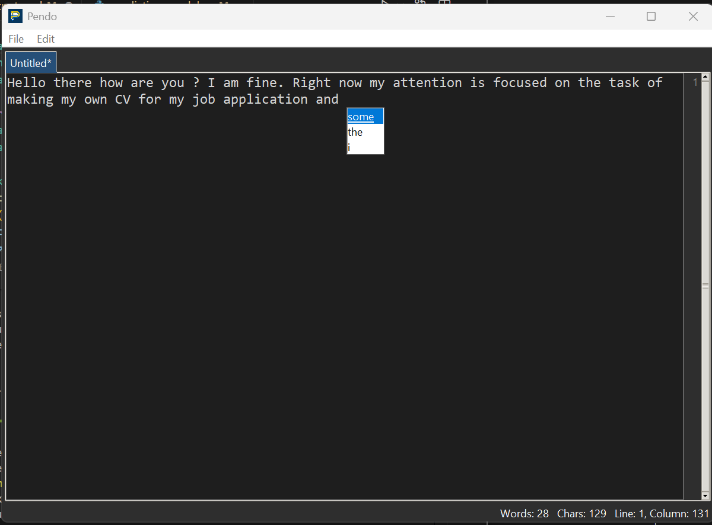

# Pendo Text Editor


Pendo is a modern, feature-rich text editor built with Python's Tkinter. It offers a clean, responsive user interface, real-time predictive text suggestions powered by a fine-tuned HuggingFace model, and essential editor functionalities for an enhanced typing experience.

## Features

*   **Modern UI:** Built with `tkinter.ttk` for a native look and feel, adapting to system light/dark themes on Windows.
*   **Tabbed Interface:** Edit multiple files concurrently with a tabbed document interface.
*   **Real-time Predictive Text:**
    *   Powered by a fine-tuned HuggingFace `bekalebendong/pendo-distilgpt2-finetuned` model.
    *   Fine-tuned on 10% of the `Salesforce/wikitext - wikitext-103-v1` dataset with an evaluation loss of 2.91.
    *   Suggestions appear inline as you type.
    *   Accept suggestions with `Tab`, `Enter`, or mouse click.
    *   Dynamic suggestion box sizing to match content.
    *   Background threading for predictions to maintain UI responsiveness.
    *   Debouncing for prediction calls to prevent lag.
*   **Line Numbers Gutter:** Displays logical line numbers alongside the text area.
*   **Status Bar:** Provides real-time information including line, column, character, and word counts.
*   **Context Menu:** Right-click for quick access to common editing actions (Cut, Copy, Paste, Undo, Redo).
*   **Customizable Settings:** Adjust font family and size via a dedicated settings window.
*   **Custom Application Icon:** Features a unique P-shaped pencil icon.
*   **Keyboard Shortcuts:**
    *   `Ctrl+N`: New File
    *   `Ctrl+O`: Open File
    *   `Ctrl+S`: Save File
    *   `Ctrl+Shift+S`: Save File As...
    *   `Ctrl+W`: Close Current Tab
*   **Unsaved Changes Indicator:** An asterisk (`*`) appears in the tab title for modified files, with prompts to save before closing.

## Screenshot



## Installation

To get Pendo Text Editor up and running on your local machine, follow these steps:

1.  **Clone the repository:**
    ```bash
    git clone https://github.com/your-username/pendo-text-editor.git
    cd pendo-text-editor
    ```
    _(Replace `your-username/pendo-text-editor.git` with the actual repository URL)_

2.  **Create a virtual environment (recommended):**
    ```bash
    python -m venv venv
    ```

3.  **Activate the virtual environment:**
    *   **On Windows:**
        ```bash
        .\venv\Scripts\activate
        ```
    *   **On macOS/Linux:**
        ```bash
        source venv/bin/activate
        ```

4.  **Install dependencies:**
    ```bash
    pip install -r requirements.txt
    ```

## Usage

To run the Pendo Text Editor, execute the `main.py` file:

```bash
python src/main.py
```

## Model Fine-tuning (Advanced)

The predictive text feature uses a fine-tuned HuggingFace model. If you wish to fine-tune the model yourself on a custom dataset or improve its performance, follow these steps. **Note: Fine-tuning requires a GPU.**

1.  **Navigate to the model training scripts:**
    ```bash
    cd src/model_training/scripts
    ```

2.  **Download the dataset:**
    ```bash
    python download_data.py
    ```
    _This will download a subset of the OpenWebText dataset to `src/model_training/data/raw/`._

3.  **Preprocess the data:**
    ```bash
    python preprocess_data.py
    ```
    _This will tokenize and format the data, saving it to `src/model_training/data/processed/`._

4.  **Fine-tune the model:**
    ```bash
    python train_model.py
    ```
    _**Ensure you are running this in a GPU environment.** This will save the fine-tuned model to `src/model_training/output/final_model/`._

5.  **Integrate the fine-tuned model:**
    *   Once fine-tuning is complete, open `src/backend/prediction_model.py`.
    *   Change the `model='distilgpt2'` line in the `Prediction` class's `__init__` method to point to your fine-tuned model's directory or HuggingFace Hub ID:
        ```python
        self.generator = pipeline('text-generation', model='bekalebendong/pendo-distilgpt2-finetuned')
        ```

## Contributing

Feel free to fork the repository, make improvements, and submit pull requests. For major changes, please open an issue first to discuss what you would like to change.

## License

This project is licensed under the MIT License.